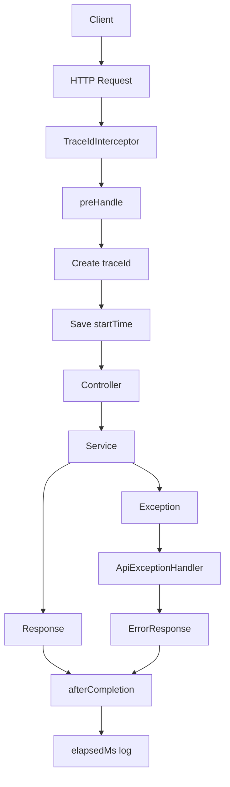

# Spring Boot API Observability Practice

## Why This Project Exists

This project is a small Spring Boot practice project for understanding request-level observability.

Monitoring answers "Is the server healthy overall?"

Observability answers "What happened to this one request?"

The main point is learning this flow:

```text
요청 들어옴
→ Interceptor preHandle
→ traceId 생성
→ 시작 시간 기록
→ Controller
→ Service
→ Response DTO 또는 ErrorResponse
→ Interceptor afterCompletion
→ 처리 시간 로그
```

## Study Goal

Spring Boot REST API에서 요청 하나마다 `traceId`를 부여하고, 요청 시작/종료 로그와 처리 시간을 남기는 구조를 학습한다.

성공 응답과 실패 응답 모두 같은 `traceId`를 공유하게 하여, PM/운영자/개발자가 특정 요청 하나를 추적할 수 있는 구조를 이해한다.

## Mermaid Flowchart



## Tech Focus

- Java 21
- Virtual Thread
- Spring Boot REST API
- `HandlerInterceptor`
- `preHandle`
- `afterCompletion`
- `traceId`
- `ThreadLocal`
- request logging
- elapsed time
- ErrorResponse traceId

## Core Files

### `TraceIdInterceptor.java`

This is the center of the project.

```java
public boolean preHandle(HttpServletRequest request, HttpServletResponse response, Object handler)
```

Before the controller runs, this method creates or receives a `traceId`.

```java
public void afterCompletion(HttpServletRequest request, HttpServletResponse response, Object handler, Exception ex)
```

After request processing ends, this method logs status code and elapsed time.

### `TraceContext.java`

This class stores the current request's `traceId`.

```java
private static final ThreadLocal<String> TRACE_ID = new ThreadLocal<>();
```

`ThreadLocal` keeps data attached to the current request-handling thread.

### `WebMvcConfig.java`

This class registers the interceptor.

```java
registry.addInterceptor(traceIdInterceptor)
        .addPathPatterns("/api/**");
```

Only `/api/**` requests are traced.

### `ChatService.java`

The response includes the current traceId.

```java
TraceContext.currentTraceId()
```

This proves that the traceId created in the interceptor can be read inside service logic.

### `ApiExceptionHandler.java`

Validation errors also include the traceId.

```java
return new ErrorResponse(
        "INVALID_REQUEST",
        "Request validation failed",
        HttpStatus.BAD_REQUEST.value(),
        request.getRequestURI(),
        TraceContext.currentTraceId(),
        fieldErrors,
        Instant.now()
);
```

This means success and failure responses can be connected to the same request log.

## Main APIs

### Chat API

```http
POST /api/chat
Content-Type: application/json
X-Trace-Id: demo-trace-001
```

Request:

```json
{
  "userId": "u01",
  "message": "observability practice",
  "model": "gemini"
}
```

Response:

```json
{
  "userId": "u01",
  "model": "gemini",
  "answer": "u01님의 요청을 gemini 모델로 처리했습니다. message = observability practice",
  "thread": "VirtualThread[...]",
  "traceId": "demo-trace-001"
}
```

### Validation Error

Invalid request:

```json
{
  "userId": "",
  "message": "",
  "model": ""
}
```

Error response:

```json
{
  "code": "INVALID_REQUEST",
  "message": "Request validation failed",
  "status": 400,
  "path": "/api/chat",
  "traceId": "demo-trace-001",
  "fieldErrors": {
    "userId": "userId is required",
    "message": "message is required",
    "model": "model is required"
  },
  "timestamp": "2026-09-05T..."
}
```

## How To Run

```powershell
./gradlew bootRun
```

Send a request with traceId:

```powershell
Invoke-RestMethod -Uri "http://localhost:8080/api/chat" -Method Post -ContentType "application/json" -Headers @{"X-Trace-Id"="demo-trace-001"} -Body '{"userId":"u01","message":"observability practice","model":"gemini"}'
```

Send a validation error request with traceId:

```powershell
Invoke-RestMethod -Uri "http://localhost:8080/api/chat" -Method Post -ContentType "application/json" -Headers @{"X-Trace-Id"="demo-trace-002"} -Body '{"userId":"","message":"","model":""}'
```

Check the console log:

```text
request start traceId=demo-trace-001 method=POST uri=/api/chat thread=...
request end traceId=demo-trace-001 method=POST uri=/api/chat status=200 elapsedMs=... thread=...
```

## PM Study Notes

Observability is important because real incidents are not solved by knowing only that the server failed.

PMs and architects should ask:

- Can one request be traced from start to finish?
- Does the response include a traceId?
- Does the error response include the same traceId?
- Can logs show method, URI, status, and elapsed time?
- Can this traceId later connect to monitoring, alert, and incident reports?

## One-Line Summary

This project practices request-level observability by adding traceId, request start/end logs, elapsed time, and ErrorResponse traceId to a Spring Boot REST API.
