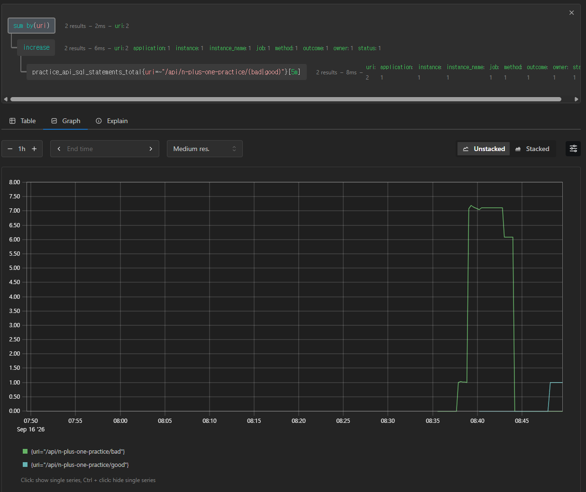

# JPA N+1 Practice

This branch is a Postman-based JPA N+1 experiment inside the Spring Boot API observability project.

## Actual Experiment Result

This is the key flow observed in this experiment:

```text
1. ChatLog list is queried first.
   select * from practice_chat_log

2. Five ChatLog objects are loaded into memory.
   But user is LAZY, so PracticeUser is not loaded yet.

3. During DTO conversion, userName is needed.
   chatLog.getUser().getName()

4. At that moment, Hibernate loads each ChatLog's User from DB one by one.
   select * from practice_user where id=?
   select * from practice_user where id=?
   select * from practice_user where id=?
   ...
```

In this experiment:

```text
ChatLog list SELECT 1 time
+ User SELECT N times
= N+1
```

So the problem is not that the Postman response is broken. The response can look perfectly normal.

The problem is hidden in the Hibernate SQL log.

The point is not to repeat generic JPA performance notes. The point is to see the hidden SQL cost behind a normal-looking API response.

## What I Tested

This experiment checks this exact situation:

```text
/bad
→ the response body looks normal
→ Hibernate first loads chat logs
→ then LAZY user access triggers repeated user SELECT queries
→ ChatLog list SELECT 1 time + User SELECT N times

/good
→ the response body looks similar
→ join fetch loads chat logs and users together
→ repeated user SELECT queries are reduced
```

N+1 is dangerous because the API can be functionally correct while SQL quietly explodes.

## Practice APIs

```text
POST /api/n-plus-one-practice/sample-data
GET  /api/n-plus-one-practice/bad
GET  /api/n-plus-one-practice/good
```

## Postman Setup

Run the server:

```powershell
./gradlew bootRun
```

Health check:

```http
GET http://localhost:8080/actuator/health
```

Expected response:

```json
{
  "status": "UP"
}
```

## What Postman Should Show

### 1. Create Sample Data

Request:

```http
POST http://localhost:8080/api/n-plus-one-practice/sample-data
X-Trace-Id: n-plus-one-sample-001
```

This creates:

```text
5 PracticeUser rows
5 PracticeChatLog rows
Each chat log points to one user with @ManyToOne(fetch = LAZY)
```

Expected response shape:

```json
{
  "mode": "sample-data",
  "message": "created 5 users and 5 chat logs",
  "count": 5,
  "traceId": "n-plus-one-sample-001",
  "chatLogs": [
    {
      "chatLogId": 1,
      "message": "message from user-1",
      "userId": 1,
      "userName": "user-1"
    }
  ]
}
```

### 2. Bad Query

Request:

```http
GET http://localhost:8080/api/n-plus-one-practice/bad
X-Trace-Id: n-plus-one-bad-001
```

What this does:

```text
1. practiceChatLogRepository.findAll()
2. Response DTO calls chatLog.getUser().getName()
3. LAZY user is accessed one by one
4. Hibernate can run repeated SELECT queries
```

Expected Postman result:

```text
The response body looks normal.
It returns chat logs with userName.
```

Expected Hibernate SQL log:

```sql
select ... from practice_chat_log ...
select ... from practice_user where id=?
select ... from practice_user where id=?
select ... from practice_user where id=?
select ... from practice_user where id=?
select ... from practice_user where id=?
```

Key evidence from `/bad`:

```text
/bad
→ API response looks correct
→ repeated SELECT queries appear in Hibernate SQL logs
→ the problem is not the response body
→ the problem is hidden DB query cost
```

### 3. Good Query

Request:

```http
GET http://localhost:8080/api/n-plus-one-practice/good
X-Trace-Id: n-plus-one-good-001
```

What this does:

```text
1. practiceChatLogRepository.findAllWithUser()
2. JPQL join fetch loads PracticeChatLog and PracticeUser together
3. Response DTO can read userName without repeated user SELECT queries
```

Expected Postman result:

```text
The response body looks similar to /bad.
It still returns chat logs with userName.
```

Expected Hibernate SQL log:

```sql
select ...
from practice_chat_log ...
join practice_user ...
```

Key evidence from `/good`:

```text
/good
→ API response looks similar to /bad
→ Hibernate SQL log shows a join query
→ repeated user SELECT queries are reduced
→ fetch join fixed the hidden query cost
```

## Result

```text
Postman confirms the API response.
Hibernate SQL logs reveal the hidden DB query cost.
traceId connects the Postman request to the server log.
```

The practical lesson:

```text
A correct API response does not guarantee an efficient API.
N+1 must be checked through Hibernate SQL logs, not only through Postman response bodies.
```

## Why This Matters

This is part of the backend feedback loop:

```text
Postman response
→ traceId logs
→ Hibernate SQL logs
→ repeated SELECT detection
→ fetch join comparison
```

The goal is to understand JPA performance by observing real request/response behavior and actual SQL execution.

## Prometheus and Grafana Check

This branch also exposes SQL statement count as application metrics.

```text
practice.api.sql.statements
practice.api.sql.statements.per.request
```

Prometheus converts dots to underscores:

```promql
practice_api_sql_statements_total
practice_api_sql_statements_per_request_count
practice_api_sql_statements_per_request_sum
```

Compare `/bad` and `/good` with these queries:

```promql
increase(practice_api_sql_statements_total{uri="/api/n-plus-one-practice/bad"}[5m])
```

```promql
increase(practice_api_sql_statements_total{uri="/api/n-plus-one-practice/good"}[5m])
```

Average SQL statements per request:

```promql
rate(practice_api_sql_statements_per_request_sum{uri="/api/n-plus-one-practice/bad"}[5m])
/
rate(practice_api_sql_statements_per_request_count{uri="/api/n-plus-one-practice/bad"}[5m])
```

```promql
rate(practice_api_sql_statements_per_request_sum{uri="/api/n-plus-one-practice/good"}[5m])
/
rate(practice_api_sql_statements_per_request_count{uri="/api/n-plus-one-practice/good"}[5m])
```

The point is:

```text
/bad  -> one HTTP request, many SQL statements
/good -> one HTTP request, fewer SQL statements
```

## Prometheus Evidence: Bad N+1 vs Good Fetch Join



Query used:

```promql
sum by(uri) (
  increase(practice_api_sql_statements_total{uri=~"/api/n-plus-one-practice/(bad|good)"}[5m])
)
```

Observed result:

```text
bad (N+1) is higher.
-> The HTTP request itself happens once.
-> But many SQL statements run inside that single request.
-> N+1 observability succeeded.

good (fetch join) is lower.
-> Fetch join reduces SQL statement count.
-> The improvement is visible in Prometheus.
```

This is the important backend observability lesson:

```text
The response body can look correct in both cases.
The real difference is hidden internal cost.
SQL count metrics make that cost visible.
```
