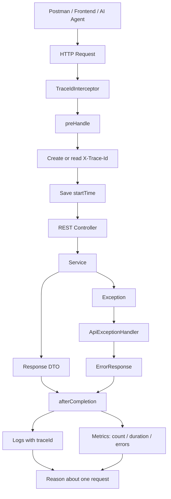

# Spring Boot API Observability Practice

## Project Focus

This project is focused on observing an API server through the three core pillars of observability:

```text
Metrics = request count, response time, error count
Logs    = request start/end/error records
Traces  = one request can be followed with the same traceId
```

The main goal is not to make a simple REST API and stop there. The goal is to send requests with Postman, read the server feedback, and understand why the server behaves a certain way.

This project is designed for AI server practice. In an AI API server, we need to observe questions like:

- Did response time increase when the prompt changed?
- Did the error rate increase when the model changed?
- Does a specific `userId` fail more often?
- Can token usage be observed later?
- Is the bottleneck inside the Spring server, DB, or external LLM API call?
- Can the same `traceId` be followed from response to logs?

## Feedback Loop

The practice flow is:

```text
Run Spring Boot server
→ Send GET/POST requests with Postman
→ Add Headers such as X-Trace-Id
→ Send JSON RequestBody
→ Check JSON ResponseBody
→ Check JSON ErrorResponse
→ Read logs with the same traceId
→ Check Actuator metrics
→ Infer what happened inside the server
```

This is the beginning of backend feedback-driven development. The server is not only coded; it is tested, observed, and improved through repeated API requests.

## Mermaid Flowchart



## What To Observe

### 1. Metrics

Metrics show server behavior as numbers.

```http
GET /actuator/metrics/practice.api.requests
GET /actuator/metrics/practice.api.request.duration
GET /actuator/metrics/practice.api.errors
GET /actuator/prometheus
```

Custom metrics:

```text
practice.api.requests
practice.api.request.duration
practice.api.errors
```

These are used to check request count, processing time, and error count.

### 2. Logs

Logs show what happened during the request.

Example:

```text
request start traceId=demo-trace-001 method=POST uri=/api/chat thread=...
request end traceId=demo-trace-001 method=POST uri=/api/chat status=200 outcome=SUCCESS elapsedMs=...
```

The same `traceId` appears in the console log.

### 3. Traces

This project uses a simple manual `traceId` practice.

```text
Postman sends X-Trace-Id
→ Interceptor stores it
→ Service reads it
→ Response includes it
→ Logs include it
→ Metrics change after the request
```

This is not full distributed tracing yet. Later this can be extended with Micrometer Tracing, OpenTelemetry, Zipkin, Jaeger, or Grafana Tempo.

## Main APIs

### Chat API

```http
POST http://localhost:8080/api/chat
Content-Type: application/json
X-Trace-Id: demo-trace-001
```

Body:

```json
{
  "userId": "u01",
  "message": "observability test",
  "model": "mock"
}
```

Expected response:

```json
{
  "userId": "u01",
  "model": "mock",
  "answer": "...",
  "thread": "VirtualThread[...]",
  "traceId": "demo-trace-001"
}
```

### Validation Error Practice

Send an invalid body:

```json
{
  "userId": "",
  "message": "",
  "model": ""
}
```

Expected error response:

```json
{
  "code": "INVALID_REQUEST",
  "message": "Request validation failed",
  "status": 400,
  "path": "/api/chat",
  "traceId": "demo-trace-error-001",
  "fieldErrors": {
    "userId": "userId is required",
    "message": "message is required",
    "model": "model is required"
  }
}
```

### Observability Guide API

```http
GET http://localhost:8080/api/observability/guide
X-Trace-Id: demo-trace-guide-001
```

## Postman Practice Set

Create and save these requests in Postman:

```text
1. POST /api/chat - normal request
2. POST /api/chat - validation error request
3. GET /actuator/metrics/practice.api.requests
4. GET /actuator/metrics/practice.api.request.duration
5. GET /actuator/metrics/practice.api.errors
6. GET /actuator/prometheus
```

Run them repeatedly and compare:

```text
Before request → after request
Normal request → error request
prompt A → prompt B
model A → model B
userId A → userId B
```

The important habit is to ask:

```text
What changed in the response?
What changed in the logs?
What changed in the metrics?
Can I follow the same traceId?
```

## How To Run

```powershell
./gradlew bootRun
```

Then test with Postman.

## One-Line Summary

This project practices AI-server-style API observability by sending Postman requests and connecting response bodies, error responses, logs, metrics, and traceId-based traces into one feedback loop.
